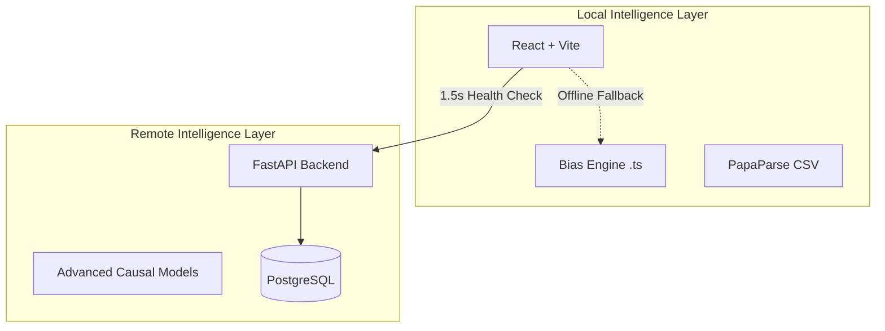

# EquityLens Intelligence

> **The next-generation healthcare fairness auditing platform. Detect bias, ensure regulatory compliance, and empower patients with explainable AI.**

[](https://opensource.org/licenses/MIT)
[](https://reactjs.org/)
[](https://vitejs.dev/)
[](https://equitylens.ai)

---

## 🏛️ Leadership & Founders

EquityLens was founded with the mission to bridge the gap between algorithmic complexity and human accountability in healthcare.

| Founder | Role | Expertise |
| :--- | :--- | :--- |
| **Kunj Shah** | Founder | Full Stack Architecture, AI/ML System Integrity |
| **Vidhya Mehta** | Co-founder | Python, AI/ML Architectures, Causal Fairness |

---

## ⚡ The Intelligent Edge

EquityLens is built for **resilience and speed**. It features a unique **Local Intelligence Engine** that ensures your audits never fail, even in air-gapped or offline environments.

- **Fast-Fail Backend Detection**: Detects server availability in <1.5 seconds.
- **Local Browser Auditing**: Seamlessly falls back to a high-performance in-browser bias engine.
- **Obsidian Void Design**: A premium, high-fidelity medical aesthetic with dark-mode depth and glassmorphism.
- **Regulatory-Ready**: Automated compliance mapping for the **EU AI Act (Art. 10)** and **NIST AI RMF**.

---

## 🛠️ Core Capabilities

### 1. Advanced Bias Diagnostics
- **Demographic Parity**: Measures outcome consistency across protected groups.
- **Equal Opportunity**: Validates that true positive rates are balanced (e.g., cancer detection accuracy).
- **Disparate Impact (80% Rule)**: Automated screening for standard regulatory violations.
- **Intersectional Matrix**: Detects hidden bias at the crossing of attributes (e.g., Race + Gender).

### 2. High-Fidelity Reporting
- **Instant PDF Audits**: Generate professional, audit-ready PDF reports with deep subgroup analysis.
- **Model Cards**: Standardized transparency documentation for stakeholders.
- **Bias Nutrition Labels**: Simplified, plain-language summaries for patients and non-technical staff.

### 3. Patient Empowerment Portal
- **Decision Transparency**: Public-facing portal for explaining algorithmic outcomes.
- **Counterfactual Simulation**: "What would change your outcome?" insights for individuals.
- **Structured Appeals**: A transparent workflow for contesting biased automated decisions.

---

## 🏗️ Architecture



---

## 🚀 Getting Started

### Quick Start (Development)

```bash
# 1. Clone & Install
git clone https://github.com/KunjShah95/fairness-lens-studio.git
npm install

# 2. Environment Setup
# Ensure VITE_API_URL points to your FastAPI backend (default: http://localhost:8001)
cp .env.example .env

# 3. Launch
npm run dev
```

### Production Build
```bash
npm run build
npm run preview
```

---

## 📊 Demo Data
The platform includes a specialized healthcare dataset: **`backend/demo-healthcare-5000.csv`**. 
- **Rows**: 5,000
- **Domain**: Medical Triage & Treatment Allocation
- **Embedded Patterns**: Realistic bias scenarios involving age, gender, and comorbidities for stress-testing auditing tools.

---

## ⚖️ Compliance Alignment

EquityLens helps organizations meet the stringent requirements of modern AI regulation:

- **EU AI Act**: Specifically addresses Article 10 (Data and Data Governance) and Article 13 (Transparency).
- **NIST AI RMF**: Aligns with the *Measure* and *Manage* functions of the framework.
- **GDPR**: Supports Article 22 through explainable outcomes and appeal workflows.

---

## 📄 License

This project is licensed under the MIT License - see the [LICENSE](LICENSE) file for details.

© 2026 EquityLens Intelligence. Built with passion for a fairer future in healthcare.