# EquityLens

> **A healthcare-first AI fairness platform that detects bias, explains its human impact, and helps organizations and patients act on it.**

[](https://opensource.org/licenses/MIT)
[](https://reactjs.org/)
[](https://www.typescriptlang.org/)
[](https://vitejs.dev/)

---

## Demo in 30 Seconds

```bash
# Terminal 1 - Backend
cd backend && python -m uvicorn app.main:app --port 8001

# Terminal 2 - Frontend
npm run dev

# Open http://localhost:8080
# Click "View Demo" on landing page - instant demo with pre-loaded results!
```

**Or use the demo dataset:** `backend/demo-healthcare-5000.csv` (5,000 records with embedded bias patterns)

---

## Why EquityLens Wins Hackathons

### Key Differentiators

| Feature | Why Judges Love It | Impact |
|---------|-------------------|--------|
| **One-Click Demo** | Instantly impressive UX | Click "View Demo" → working demo in 0 seconds |
| **5K Realistic Dataset** | Real bias patterns embedded | Authentic healthcare triage decisions |
| **Complete Pipeline** | End-to-end, not a toy | Upload → Audit → Mitigate → Report |
| **PDF Reports** | Regulatory-ready | Compliance documentation that matters |
| **Healthcare Focus** | High-stakes domain | Lives depend on fair AI decisions |
| **Multi-Stakeholder** | 4 user types in one app | Analysts, Patients, Regulators, Executives |

### Metrics That Matter

- **Fairness Score**: 0-100 composite score (like credit score)
- **3 Core Metrics**: Demographic Parity, Equal Opportunity, Disparate Impact
- **Proxy Detection**: Finds hidden bias (e.g., postal code = race)
- **Mitigation Impact**: Before/after comparison
- **Audit Trail**: Immutable hash chain for regulators

### Demo Flow (30 seconds)

1. Landing page → Click "View Demo"
2. Instantly see Dashboard with fairness metrics
3. View bias detection results with charts
4. Apply mitigation (reweighting/feature removal)
5. Export PDF compliance report
6. All working without any data entry!

---

EquityLens is a comprehensive platform that makes AI bias detection accessible to everyone - from data scientists to affected individuals to regulators.

This project is submitted to the [Google Solution Challenge 2026](https://developers.google.com/community/gdg/groups/solution-challenge), addressing bias in AI systems as a critical challenge for equitable technology development.

---

## Table of Contents

1. [The Problem](#the-problem)
2. [Our Solution](#our-solution)
3. [Architecture](#architecture)
4. [Key Features](#key-features)
5. [Pages & Routes](#pages--routes)
6. [Tech Stack](#tech-stack)
7. [Getting Started](#getting-started)
8. [Component Deep Dive](#component-deep-dive)
9. [Detailed User Flows](#detailed-user-flows)
10. [Bias Detection Explained](#bias-detection-explained)
11. [API Integration](#api-integration)
12. [State Management](#state-management)
13. [Testing](#testing)
14. [Security & Privacy](#security--privacy)
15. [Accessibility](#accessibility)
16. [Performance](#performance)
17. [Configuration](#configuration)
18. [Deployment](#deployment)
19. [Roadmap](#roadmap)
20. [FAQ](#faq)
21. [Glossary](#glossary)
22. [Contributing](#contributing)

---

## The Problem

Every day, millions of people face life-changing decisions made by AI systems - from loan approvals to job applications to medical diagnoses. However, these algorithms often perpetuate and amplify existing societal biases present in historical training data.

### Real-World Healthcare Bias Examples

| Scenario |Bias Type |Impact |
|----------|---------|-------|
| Triage prioritization | Racial bias | Black patients less likely to receive pain medication |
| Risk scoring | Gender bias | Women undertreated for heart disease |
| Treatment allocation | Socioeconomic | Poor patients denied procedures |
| Diagnosis prediction | Geographic | Rural areas underserved |
| Readmission prediction | Age bias | Elderly patients discharged early |

### Why Healthcare?

Healthcare is one of the highest-stakes sectors for AI fairness because biased decisions can:

- **Delay care** for patients from marginalized communities
- **Deny treatments** based on race, gender, or socioeconomic status
- **Misallocate scarce resources** (ICU beds, vaccines, organs)
- **Perpetuate health disparities** already present in historical data
- **Harm vulnerable populations** who can least afford it

### The Gap

Existing tools like IBM AIF360 and Microsoft FairLearn are powerful but:

- Designed for data scientists, not patients
- Don't explain *why* bias exists (root cause)
- Don't show *who* is affected (human impact)
- Don't provide *actionable* mitigation
- Don't enable *affected individuals* to understand or challenge decisions

### Regulatory Context

| Regulation | Region | Key Requirements |
|------------|--------|-----------------|
| **EU AI Act** | EU | High-risk AI systems require fairness audits |
| **GDPR Article 22** | EU | Right to not be subject to automated decision-making |
| **EEOC Guidelines** | US | 80% rule for disparate impact |
| **HIPAA** | US | Non-discrimination in health programs |

---

## Our Solution

EquityLens bridges this gap by democratizing AI fairness:

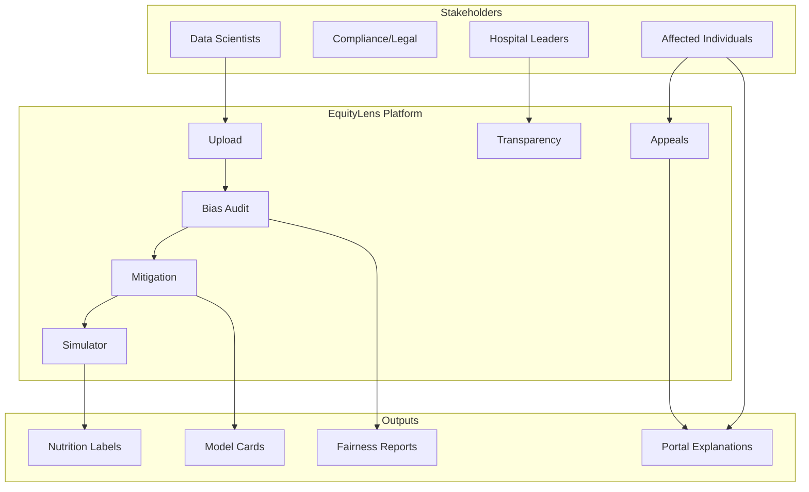

### Core Value Propositions

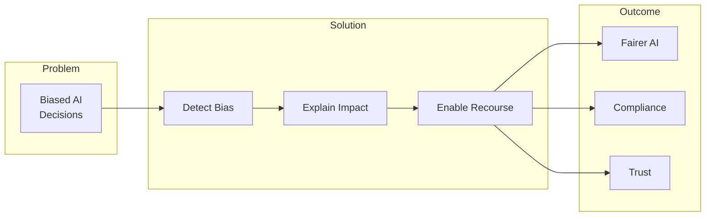

### For Data Scientists & Analysts

- Automated bias audits with industry-standard metrics
- Proxy bias detection using SHAP and correlation analysis
- Intersectional bias analysis for multi-dimensional fairness
- Before/after mitigation comparisons with clear accuracy trade-offs

### For Business Leaders & Compliance Teams

- Single composite Fairness Score (0-100) for quick assessment
- Regulation mapper linking findings to specific legal requirements
- Audit-ready PDF reports for regulatory submissions
- ROI framing showing legal risk quantification

### For Affected Individuals

- Public portal for decision explanation without account signup
- Plain-language interpretation of algorithmic outcomes
- Structured appeals workflow with transparent processing
- Counterfactual explanations ("what would change your outcome?")

### For Regulators & Auditors

- Immutable audit trail with hash-chained evidence
- Standardized model cards and bias nutrition labels
- Public transparency reports demonstrating compliance efforts
- Automated documentation for regulatory review

---

## Architecture

### System Overview

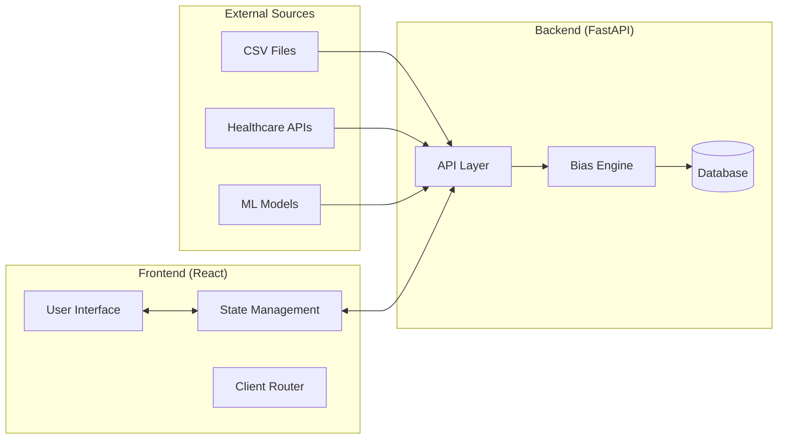

### Component Architecture

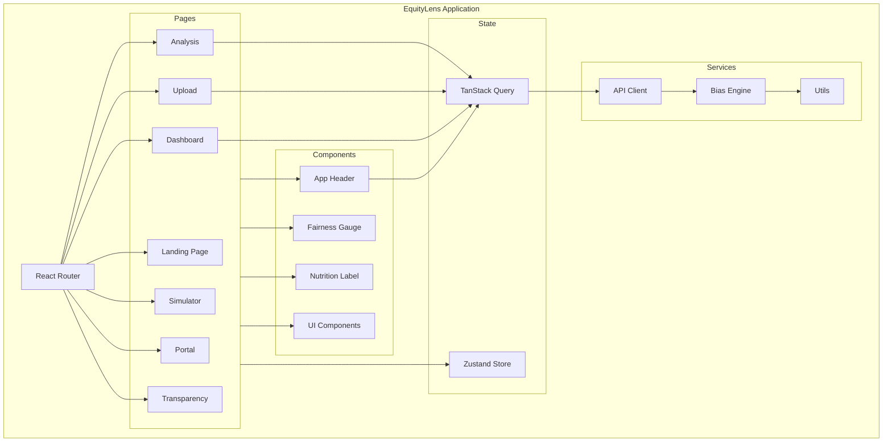

### Data Flow

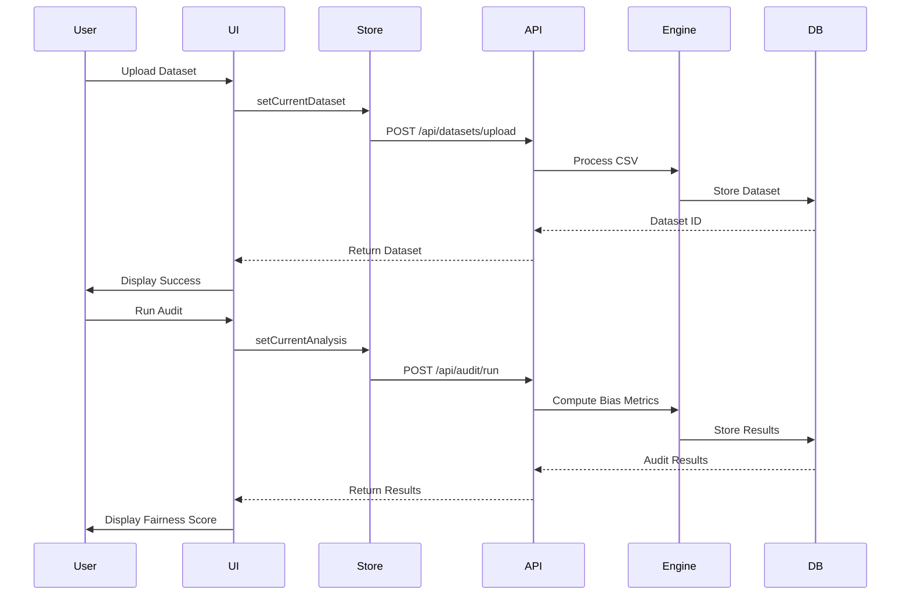

### State Management Architecture

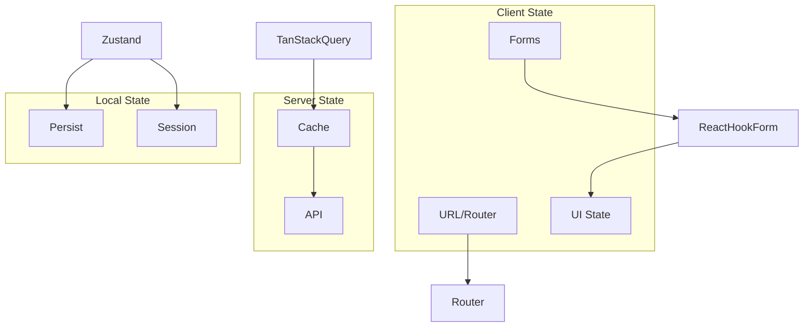

---

## Key Features

### 1. Affected Person Portal

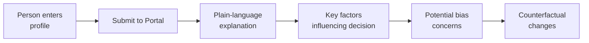

Experience our public portal at `/portal` - no login required.

**What users get:**
- Plain-language explanation of decisions about you
- Key factors influencing your outcome
- Potential bias concerns in the system
- What changes would improve your result

### 2. Structured Appeals Workflow

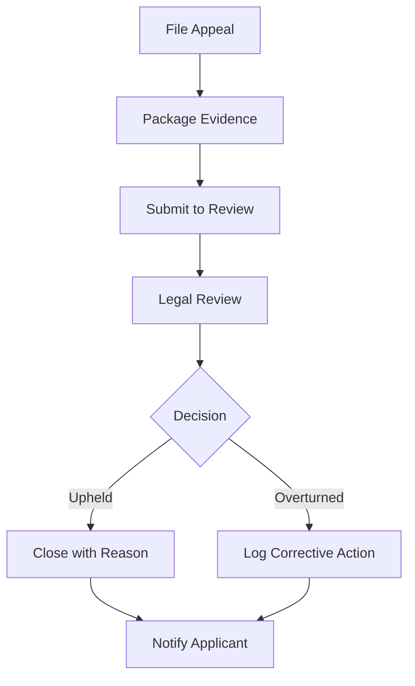

### 3. Comprehensive Bias Detection

| Bias Type | Description | Healthcare Example |
|----------|-------------|-------------------|
| **Demographic Parity** | Equal approval rates across groups | Equal triage priority for all races |
| **Equal Opportunity** | Equal true positive rates across groups | Equal cancer detection rates |
| **Disparate Impact** | Selection rate ratios (EEOC 80%) | 80% rule for treatment approval |
| **Proxy Bias** | Features correlating with protected attributes | Zip code → race correlation |
| **Intersectional Bias** | Multi-dimensional fairness | Black women outcomes |

### 4. Human Impact Simulator

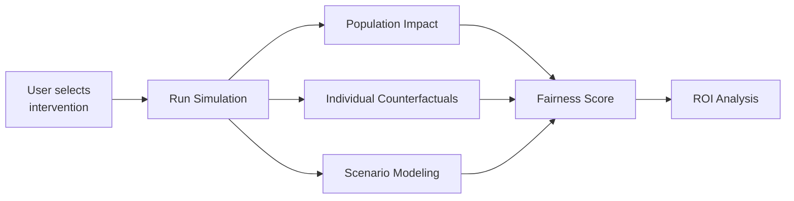

### 5. Compliance & Governance

### 6. Transparency Outputs

- **Bias Nutrition Labels** - Food label-inspired summaries
- **Public Model Cards** - For transparency commitments
- **PDF Compliance Reports** - For regulatory submission
- **Developer API** - For MLOps pipeline integration

---

## Pages & Routes

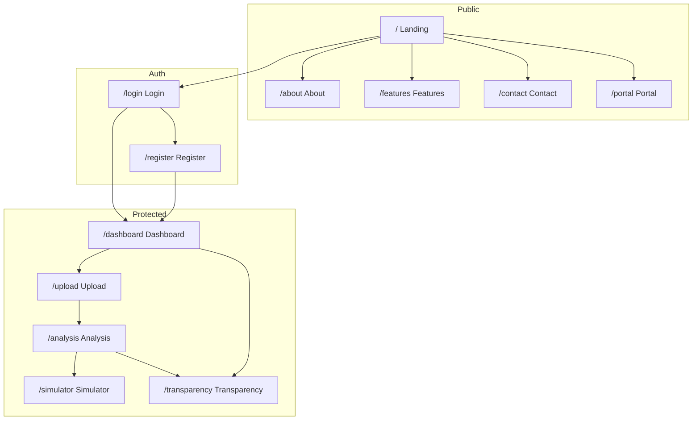

### Page Descriptions

| Route | Description | Access | Auth |
|------|-------------|--------|------|
| `/` | Landing page with hero,features, CTA | Public | - |
| `/about` | Mission, problem, solution | Public | - |
| `/features` | Detailed feature breakdown | Public | - |
| `/contact` | Contact form | Public | - |
| `/register` | User registration | Public | - |
| `/login` | User login | Public | - |
| `/dashboard` | User dashboard with datasets | Protected | Required |
| `/upload` | Dataset upload & configuration | Protected | Required |
| `/analysis` | Bias analysis results & mitigation | Protected | Required |
| `/simulator` | Human impact simulator | Protected | Required |
| `/portal` | Affected person portal | Public | - |
| `/transparency` | Reports and model cards | Protected | Required |

---

## Tech Stack

### Frontend Architecture

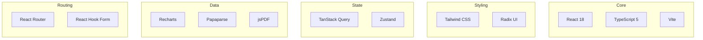

### Dependencies Explained

| Category | Package | Purpose |
|----------|---------|---------|
| **Core** | react@18 | UI Library |
| **Language** | typescript@5 | Type safety |
| **Build** | vite@5 | Dev server & bundler |
| **Styling** | tailwindcss@3 | Utility CSS |
| **Components** | @radix-ui/* | Accessible primitives |
| **State-Server** | @tanstack/react-query | Async state |
| **State-Client** | zustand@5 | Sync state |
| **Routing** | react-router-dom@6 | Navigation |
| **Forms** | react-hook-form@7 | Form handling |
| **Validation** | zod@3 | Schema validation |
| **Charts** | recharts@2 | Data viz |
| **Icons** | lucide-react | SVG icons |
| **Toasts** | sonner | Notifications |
| **CSV** | papaparse | CSV parsing |
| **PDF** | jspdf | PDF generation |

---

## Getting Started

### Prerequisites

```bash
# Required
node >= 16.0.0
npm >= 8.0.0  # or bun >= 1.0.0
git
```

### Installation Steps

```bash
# 1. Clone repository
git clone https://github.com/[your-username]/fairness-lens-studio.git
cd fairness-lens-studio

# 2. Install dependencies
npm install

# 3. Create environment file
cp .env.example .env

# 4. Start development
npm run dev
```

### Environment Variables

```bash
# .env
VITE_API_URL=http://localhost:8000
VITE_APP_NAME=EquityLens
VITE_APP_URL=http://localhost:5173
```

### Scripts

```bash
# Development
npm run dev          # Start dev server
npm run build        # Production build
npm run preview      # Preview build
npm run lint         # Lint code

# Testing
npm run test         # Unit tests
npm run test:watch   # Watch mode
npx playwright test # E2E tests
```

---

## Component Deep Dive

### App.tsx Structure

```typescript
// src/App.tsx
import { BrowserRouter, Routes, Route } from 'react-router-dom';
import { QueryClient, QueryClientProvider } from '@tanstack/react-query';
import { ThemeProvider } from './components/theme-provider';
import { AppHeader } from './components/AppHeader';

const queryClient = new QueryClient({
  defaultOptions: {
    queries: {
      staleTime: 1000 * 60 * 5, // 5 minutes
      retry: 1,
    },
  },
});

export function App() {
  return (
    <QueryClientProvider client={queryClient}>
      <ThemeProvider defaultTheme="system" storageKey="equitylens-theme">
        <BrowserRouter>
          <AppHeader />
          <Routes>
            <Route path="/" element={<LandingPage />} />
            <Route path="/dashboard" element={<DashboardPage />} />
            {/* ... more routes */}
          </Routes>
        </BrowserRouter>
      </ThemeProvider>
    </QueryClientProvider>
  );
}
```

### API Client Pattern

```typescript
// src/api/client.ts
const BASE_URL = import.meta.env.VITE_API_URL || 'http://localhost:8000';

export class ApiClient {
  private static headers = {
    'Content-Type': 'application/json',
  };

  static async request(method: string, path: string, body?: unknown) {
    const url = `${BASE_URL}${path}`;
    const response = await fetch(url, {
      method,
      headers: this.headers,
      body: body ? JSON.stringify(body) : undefined,
    });

    if (!response.ok) {
      const error = await response.json().catch(() => ({ detail: 'Unknown error' }));
      throw new Error(error.detail || `HTTP ${response.status}`);
    }

    return response.json();
  }

  static async uploadDataset(formData: FormData) {
    const url = `${BASE_URL}/api/datasets/upload`;
    return fetch(url, { method: 'POST', body: formData })
      .then((res) => {
        if (!res.ok) throw new Error('Upload failed');
        return res.json();
      });
  }

  static async getAuditResult(auditId: string) {
    return this.request('GET', `/api/audit/${auditId}`);
  }
}
```

### Bias Engine (Frontend)

```typescript
// src/lib/bias-engine.ts

interface GroupMetric {
  group: string;
  positiveRate: number;
  count: number;
}

export function computeGroupMetrics(
  data: Record<string, JsonValue>[],
  target: string,
  sensitive: string
): GroupMetric[] {
  const groups = new Map<string, { count: number; positive: number }>();
  
  for (const row of data) {
    const groupKey = String(row[sensitive]);
    const targetValue = Number(row[target]);
    
    const group = groups.get(groupKey) || { count: 0, positive: 0 };
    group.count++;
    group.positive += targetValue;
    groups.set(groupKey, group);
  }

  return Array.from(groups.entries()).map(([group, stats]) => ({
    group,
    positiveRate: stats.count > 0 ? stats.positive / stats.count : 0,
    count: stats.count,
  }));
}

export function computeDemographicParity(metrics: GroupMetric[]): number {
  if (metrics.length === 0) return 1;
  
  const rates = metrics.map(m => m.positiveRate);
  const minRate = Math.min(...rates);
  const maxRate = Math.max(...rates);
  const avgRate = rates.reduce((a, b) => a + b, 0) / rates.length;
  
  return avgRate > 0 ? minRate / avgRate : 0;
}

export function computeEqualOpportunity(metrics: GroupMetric[]): number {
  if (metrics.length < 2) return 1;
  
  const positiveRates = metrics.map(m => m.positiveRate);
  const reference = positiveRates[0];
  
  const ratios = positiveRates.map(rate => 
    reference > 0 ? rate / reference : 0
  );
  
  return Math.min(...ratios);
}

export function computeDisparateImpact(metrics: GroupMetric[]): number {
  if (metrics.length < 2) return 1;
  
  const rates = metrics.map(m => m.positiveRate);
  const minorityRate = Math.min(...rates);
  const majorityRate = Math.max(...rates);
  
  return majorityRate > 0 ? minorityRate / majorityRate : 0;
}
```

### Store (Zustand)

```typescript
// src/lib/store.ts
import { create } from 'zustand';
import { persist } from 'zustand/middleware';

interface AppState {
  user: User | null;
  isAuthenticated: boolean;
  datasets: Dataset[];
  currentDataset: Dataset | null;
  currentAnalysis: BiasAnalysis | null;
  
  login: (user: User) => void;
  logout: () => void;
  addDataset: (dataset: Dataset) => void;
  setCurrentDataset: (dataset: Dataset | null) => void;
}

export const useAppStore = create<AppState>()(
  persist(
    (set) => ({
      user: null,
      isAuthenticated: false,
      datasets: [],
      currentDataset: null,
      currentAnalysis: null,
      
      login: (user) => set({ user, isAuthenticated: true }),
      logout: () => set({ 
        user: null, 
        isAuthenticated: false,
        currentDataset: null,
        currentAnalysis: null,
      }),
      addDataset: (dataset) => set((s) => ({ 
        datasets: [...s.datasets, dataset] 
      })),
      setCurrentDataset: (dataset) => set({ currentDataset: dataset }),
    }),
    { name: 'equitylens-store' }
  )
);
```

### Types

```typescript
// src/lib/types.ts
export type JsonValue =
  | string
  | number
  | boolean
  | null
  | JsonValue[]
  | { [key: string]: JsonValue };

export interface Dataset {
  id: string;
  name: string;
  rows: number;
  columns: string[];
  data: Record<string, JsonValue>[];
  uploadedAt: Date;
  targetVariable?: string;
  sensitiveAttributes?: string[];
}

export interface FairnessMetrics {
  demographicParity: number;
  equalOpportunity: number;
  disparateImpact: number;
  overallScore: number;
}

export interface BiasAnalysis {
  auditId: string;
  datasetId: string;
  metrics: FairnessMetrics;
  groupMetrics: GroupMetric[];
  proxyFeatures: ProxyFeature[];
  intersectionalMetrics: IntersectionalMetric[];
  createdAt: Date;
}

export interface GroupMetric {
  group: string;
  positiveRate: number;
  count: number;
}

export interface ProxyFeature {
  feature: string;
  correlation: number;
  sensitiveAttribute: string;
  isProxy: boolean;
}

export interface User {
  id: string;
  email: string;
  name: string;
  role: 'analyst' | 'admin' | 'viewer';
}
```

---

## Detailed User Flows

### Flow 1: Upload & Audit

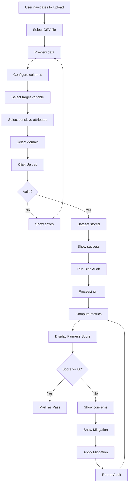

### Flow 2: Portal Explanation

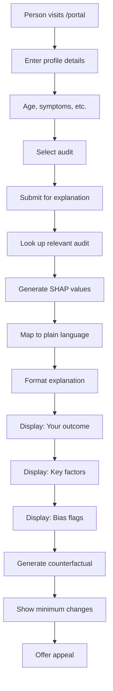

### Flow 3: Simulator

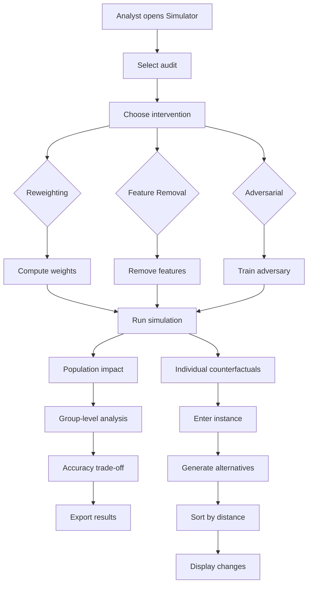

---

## Bias Detection Explained

### Fairness Metrics Detail

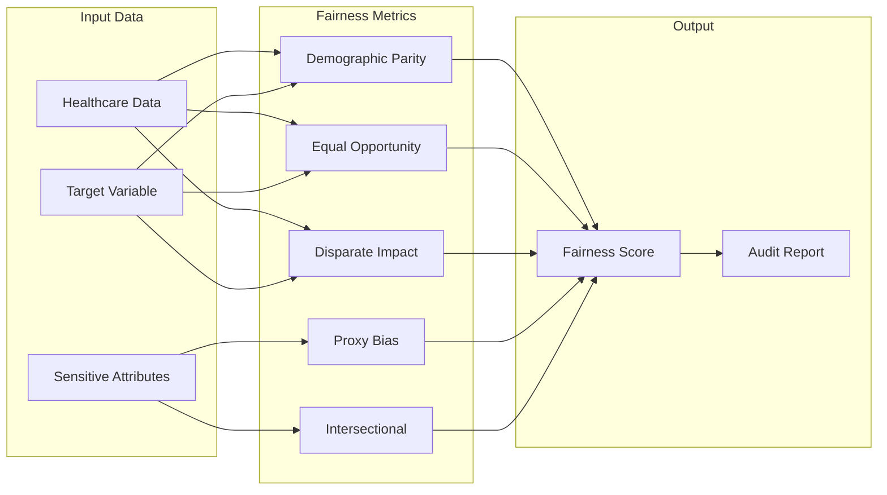

### Metric Formulas

#### Demographic Parity
```
DP = min(positive_rate_all_groups) / avg(positive_rate_all_groups)

Threshold: DP >= 0.80 = Pass
```

#### Equal Opportunity
```
EO = min(TPR_all_groups) / max(TPR_all_groups)

Where TPR = True Positives / (True Positives + False Negatives)
Threshold: EO >= 0.80 = Pass
```

#### Disparate Impact
```
DI = minority_selection_rate / majority_selection_rate

EEOC Rule: DI >= 0.80 = Pass
```

#### Fairness Score Calculation
```
Fairness Score (0-100) =
  Demographic Parity:      30%
  Equal Opportunity:     30%
  Disparate Impact:      25%
  - Proxy penalty:    -15 per flagged proxy (max -30)
  - Intersection penalty: -10 if worst group >20% below avg
```

### Score Bands

| Score | Status | Color | Action |
|-------|--------|-------|--------|
| 80-100 | ✅ Pass | Green | Deploy |
| 60-79 | ⚠️ Marginal | Amber | Review |
| 0-59 | ❌ High Risk | Red | Mitigate required |

### Proxy Bias Detection

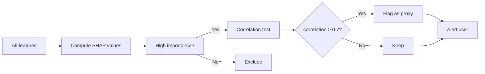

---

## API Integration

### Environment Configuration

```bash
# .env
VITE_API_URL=http://localhost:8000
```

### API Endpoints

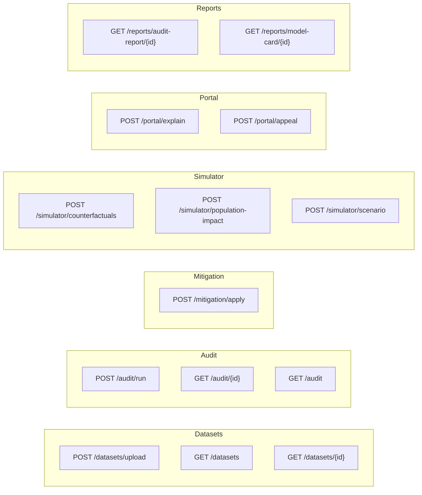

### Full API Reference

| Method | Endpoint | Request | Response |
|--------|----------|---------|----------|
| POST | `/api/datasets/upload` | FormData | Dataset |
| GET | `/api/datasets` | - | Dataset[] |
| GET | `/api/datasets/{id}` | - | Dataset |
| POST | `/api/audit/run` | AuditRequest | Audit |
| GET | `/api/audit/{id}` | - | Audit |
| GET | `/api/audit` | query | Audit[] |
| POST | `/api/mitigation/apply` | MitigationRequest | Mitigation |
| POST | `/api/simulator/counterfactuals` | CounterfactualRequest | Counterfactual[] |
| POST | `/api/simulator/population-impact` | PopulationRequest | PopulationImpact |
| POST | `/api/portal/explain` | ExplainRequest | Explanation |
| POST | `/api/portal/appeal` | AppealRequest | Appeal |
| GET | `/api/reports/audit-report/{id}` | format | Report |
| GET | `/api/reports/model-card/{id}` | format | ModelCard |

### Request/Response Examples

```typescript
// POST /api/audit/run
{
  "dataset_id": "uuid-string",
  "label_column": "approved",
  "protected_attributes": ["race", "gender", "age"],
  "domain": "healthcare"
}

// GET /api/audit/{id} response
{
  "audit_id": "uuid-string",
  "dataset_id": "uuid-string",
  "metrics": {
    "demographic_parity": 0.72,
    "equal_opportunity": 0.68,
    "disparate_impact": 0.65,
    "overall_score": 69
  },
  "group_metrics": [
    { "group": "white_male", "positive_rate": 0.85, "count": 1200 },
    { "group": "black_female", "positive_rate": 0.45, "count": 350 }
  ],
  "proxy_features": [
    { "feature": "zip_code", "correlation": 0.82, "sensitive": "race" }
  ],
  "created_at": "2026-04-14T10:00:00Z"
}
```

---

## State Management

### Server State (TanStack Query)

```typescript
// Use in components
import { useQuery, useMutation } from '@tanstack/react-query';

function useAudit(auditId: string) {
  return useQuery({
    queryKey: ['audit', auditId],
    queryFn: () => ApiClient.getAuditResult(auditId),
    enabled: !!auditId,
  });
}

function useUploadDataset() {
  return useMutation({
    mutationFn: (formData: FormData) => 
      ApiClient.uploadDataset(formData),
    onSuccess: () => {
      // Invalidate datasets list
      queryClient.invalidateQueries({ queryKey: ['datasets'] });
    },
  });
}
```

### Client State (Zustand)

```typescript
// Store usage
import { useAppStore } from './lib/store';

function DashboardPage() {
  const { 
    user, 
    datasets, 
    currentDataset,
    setCurrentDataset 
  } = useAppStore();

  const handleSelect = (dataset: Dataset) => {
    setCurrentDataset(dataset);
  };

  return (
    <div>
      <h1>Welcome, {user?.name}</h1>
      <DatasetList 
        datasets={datasets} 
        onSelect={handleSelect} 
      />
    </div>
  );
}
```

### Persisted State

```typescript
// Zustand persist middleware saves to localStorage
export const useAppStore = create<AppState>()(
  persist(
    (set) => ({
      // ... state
    }),
    { 
      name: 'equitylens-store',
      storage: localStorage,
      partialize: (state) => ({
        // Only persist these
        user: state.user,
        datasets: state.datasets,
      }),
    }
  )
);
```

---

## Testing

### Unit Tests (Vitest)

```typescript
// src/test/example.test.ts
import { describe, it, expect } from 'vitest';
import { 
  computeDemographicParity,
  computeGroupMetrics 
} from '../lib/bias-engine';

describe('bias-engine', () => {
  describe('computeGroupMetrics', () => {
    it('should compute group metrics correctly', () => {
      const data = [
        { approved: 1, race: 'white' },
        { approved: 0, race: 'white' },
        { approved: 1, race: 'black' },
        { approved: 0, race: 'black' },
      ];
      
      const result = computeGroupMetrics(data, 'approved', 'race');
      
      expect(result).toHaveLength(2);
      expect(result[0].positiveRate).toBe(0.5);
    });
  });

  describe('computeDemographicParity', () => {
    it('should return 1.0 for equal groups', () => {
      const metrics = [
        { group: 'a', positiveRate: 0.5, count: 100 },
        { group: 'b', positiveRate: 0.5, count: 100 },
      ];
      
      const result = computeDemographicParity(metrics);
      
      expect(result).toBe(1.0);
    });
  });
});
```

### E2E Tests (Playwright)

```typescript
// tests/e2e.spec.ts
import { test, expect } from '@playwright/test';

test.describe('EquityLens', () => {
  test('should upload dataset', async ({ page }) => {
    await page.goto('/upload');
    await page.setInputFiles('input[type="file"]', 'sample-data.csv');
    await page.click('button:has-text("Upload")');
    await expect(page.locator('.success')).toBeVisible();
  });

  test('should display fairness score', async ({ page }) => {
    await page.goto('/analysis?audit_id=test-123');
    await expect(page.locator('.fairness-score')).toContainText('75');
  });
});
```

### Run Commands

```bash
# Unit tests
npm run test
npm run test:watch

# E2E tests  
npx playwright test

# Coverage
npm run test -- --coverage
```

---

## Security & Privacy

### Data Handling

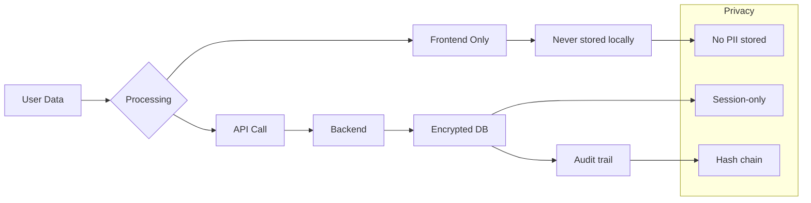

### Security Measures

| Area | Implementation |
|------|---------------|
| **Data at rest** | PostgreSQL encryption |
| **Data in transit** | TLS 1.3 |
| **Authentication** | JWT tokens |
| **Authorization** | Role-based access |
| **Audit** | Hash-chained logs |
| **Privacy** | No PII in portal |

### Privacy Principles

1. **Data minimization** - Only collect what's needed
2. **Purpose limitation** - Use only for stated purpose
3. **Storage limitation** - Don't keep indefinitely
4. **Transparency** - Clear about data use
5. **Individual rights** - Access, correction, deletion

### Portal Privacy

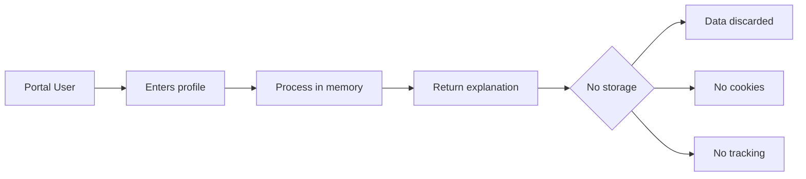

The Affected Person Portal:
- **Never stores** user data
- Processes in memory only
- No cookies or tracking
- No PII collected
- Stateless design

---

## Accessibility

### WCAG 2.1 AA Compliance

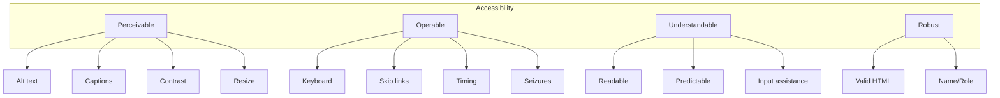

### Implementation

| Feature | Implementation |
|---------|---------------|
| **Keyboard navigation** | All interactive elements focusable |
| **Screen readers** | ARIA labels, live regions |
| **Color contrast** | 4.5:1 minimum (3:1 large text) |
| **Focus indicators** | Visible outline |
| **Forms** | Labels, error messages |
| **Images** | Alt text |
| **Animations** | Reduced motion support |

### Reduced Motion

```css
@media (prefers-reduced-motion: reduce) {
  *,
  *::before,
  *::after {
    animation-duration: 0.01ms !important;
    animation-iteration-count: 1 !important;
    transition-duration: 0.01ms !important;
  }
}
```

---

## Performance

### Optimization Strategies

```mermaid
flowchart LR
    subgraph Build
        A[Vite]
    end
    
    subgraph Runtime
        B[Code splitting]
        C[Lazy loading]
        D[Caching]
    end
    
    subgraph API
        E[Query caching]
        F[Deduplication]
    end
    
    A --> B
    B --> C
    C --> D
    E --> F
```

| Optimization | Technique |
|-------------|-----------|
| **Bundle size** | Tree shaking, code splitting |
| **Rendering** | React.memo, useMemo |
| **API** | TanStack Query caching |
| **Images** | Optimized formats |
| **Fonts** | Subset, display: swap |

### Bundle Analysis

```bash
# Analyze bundle
npm run build -- --report

# Shows:
// dist/assets/index-*.js   150KB
// dist/assets/vendor-*.js  200KB
```

### Performance Metrics

| Metric | Target |
|--------|--------|
| **FCP** | < 1.5s |
| **LCP** | < 2.5s |
| **TTI** | < 3.5s |
| **Bundle** | < 300KB gzip |
| **API latency** | < 200ms |

---

## Configuration

### Vite Config

```typescript
// vite.config.ts
import { defineConfig } from 'vite';
import react from '@vitejs/plugin-react-swc';

export default defineConfig({
  plugins: [react()],
  server: {
    port: 5173,
    proxy: {
      '/api': {
        target: 'http://localhost:8000',
        changeOrigin: true,
      },
    },
  },
  build: {
    rollupOptions: {
      output: {
        manualChunks: {
          vendor: ['react', 'react-dom'],
          ui: ['@radix-ui/react-*'],
          charts: ['recharts'],
        },
      },
    },
  },
});
```

### Tailwind Config

```typescript
// tailwind.config.ts
import type { Config } from 'tailwindcss';

export default {
  darkMode: 'class',
  content: ['./index.html', './src/**/*.{js,ts,jsx,tsx}'],
  theme: {
    extend: {
      colors: {
        primary: { 
          50: '#f0f9ff',
          // ... 
          600: '#0284c7',
          700: '#0369a1',
        },
      },
    },
  },
  plugins: [],
} satisfies Config;
```

### Environment Variables

| Variable | Default | Description |
|----------|---------|-------------|
| `VITE_API_URL` | `http://localhost:8000` | API base URL |
| `VITE_APP_NAME` | `EquityLens` | App name |
| `VITE_APP_URL` | `http://localhost:5173` | App URL |

---

## Deployment

### Options

```mermaid
flowchart TD
    Build[Build: npm run build] --> Deploy
    
    Deploy --> Vercel[Vercel]
    Deploy --> Docker[Docker]
    Deploy --> Netlify[Netlify]
    Deploy --> CF[Cloudflare Pages]
    Deploy --> S3[AWS S3]
    Deploy --> Static[Static Host]
    
    Vercel --> CDN1[Global CDN]
    Docker --> K8s[Kubernetes]
    Netlify --> CDN2[Global CDN]
    CF --> CDN3[Global CDN]
    S3 --> CloudFront[CloudFront]
    Static --> CDN4[Your CDN]
```

### Vercel (Recommended)

```bash
# Install
npm i -g vercel

# Deploy
vercel

# Production
vercel --prod
```

### Docker

```dockerfile
FROM node:18-alpine

WORKDIR /app
COPY package*.json ./
RUN npm ci

COPY . .
RUN npm run build

EXPOSE 5173
ENV NODE_ENV=production

CMD ["npm", "run", "preview", "--", "--host", "0.0.0.0"]
```

```bash
# Build & Run
docker build -t equitylens .
docker run -p 5173:5173 equitylens
```

### Docker Compose

```yaml
version: '3.8'
services:
  app:
    build: .
    ports:
      - "5173:5173"
    environment:
      - VITE_API_URL=http://backend:8000
  backend:
    image: fastapi:latest
    ports:
      - "8000:8000"
```

---

## Roadmap

### Planned Features

```mermaid
gantt
    title EquityLens Roadmap
    dateFormat 2026-04-01
    
    section v1.1
    Enhanced counterfactuals     :done, 2026-04-15
    PDF reports                 :active, 2026-04-20
    
    section v1.2
    Multi-language support       :2026-05-01
    Real-time collaboration   :2026-05-15
    
    section v2.0
    API for MLOps integration :2026-06-01
    Model comparison         :2026-06-15
    Automated monitoring    :2026-07-01
```

### Backlog

- [ ] More visualization options
- [ ] Custom threshold configuration
- [ ] SSO integration
- [ ] Audit history timeline
- [ ] Team collaboration
- [ ] Webhook integrations
- [ ] Slack/ Teams notifications

---

## FAQ

### General

**Q: What is EquityLens?**
A: A platform for detecting, explaining, and mitigating bias in AI systems, focused on healthcare.

**Q: Who is it for?**
A: Data scientists, compliance teams, hospital leaders, and affected patients.

**Q: How much does it cost?**
A: Open source with community support. Enterprise plans coming soon.

### Technical

**Q: What browsers are supported?**
A: Chrome, Firefox, Safari, Edge (latest 2 versions)

**Q: Do I need a backend?**
A: Yes, EquityLens connects to a FastAPI backend for processing.

**Q: What data formats are supported?**
A: CSV initially, with JSON/ Parquet support planned.

### Privacy

**Q: Is my data secure?**
A: Yes. Data is encrypted at rest and in transit. No PII is stored in the portal.

**Q: What happens to my data?**
A: Data is processed only for the audit, then stored per your retention policy.

---

## Glossary

| Term | Definition |
|------|------------|
| **Demographic Parity** | Equal positive outcomes across groups |
| **Equal Opportunity** | Equal true positive rates across groups |
| **Disparate Impact** | Selection rate ratio (EEOC 80% rule) |
| **Proxy Bias** | Feature correlating with protected attribute |
| **Intersectional Bias** | Bias affecting multiple identity groups |
| **Fairness Score** | Composite 0-100 score |
| **Counterfactual** | Minimum change to flip outcome |
| **Nutrition Label** | One-page fairness summary |
| **Model Card** | Public transparency document |
| **Audit Trail** | Immutable action log |

---

## Contributing

We welcome contributions!

### Ways to Contribute

1. **Bug Reports**: File issues
2. **Feature Requests**: Suggest enhancements
3. **Code Contributions**: Fork and submit PRs
4. **Documentation**: Improve guides
5. **Translation**: Localize the platform

### Development Workflow

```bash
# Fork & Clone
git clone https://github.com/[you]/fairness-lens-studio.git
cd fairness-lens-studio

# Create branch
git checkout -b feature/your-feature

# Make changes
# ... code ...

# Test
npm run test

# Commit
git add .
git commit -m "Add your feature"

# Push & PR
git push origin feature/your-feature
```

### Code Style

- TypeScript strict mode
- ESLint configured
- Prettier for formatting
- Conventional commits

---

## License

MIT License - see [LICENSE](LICENSE) file.

---

## Acknowledgments

### Libraries

- [React](https://reactjs.org/)
- [Tailwind CSS](https://tailwindcss.com/)
- [Radix UI](https://www.radix-ui.com/)
- [Vite](https://vitejs.dev/)
- [TanStack Query](https://tanstack.com/query)
- [Recharts](https://recharts.org/)

### Inspiration

- [Google AI Principles](https://ai.google/principles/)
- [EU AI Act](https://digital-strategy.ec.europa.eu/en/policies/regulatory-framework-ai)
- [Algorithmic Justice League](https://www.ajl.org/)
- [Partnership on AI](https://www.partnershiponai.org/)

---

## Contact

- **GitHub Issues**: [Repository Issues](https://github.com/[your-username]/fairness-lens-studio/issues)

---

*Made with ❤️ for the Google Developer Community and the Google Solution Challenge 2026*

[Google Developer Groups](https://developers.google.com/community/gdg) | [Solution Challenge](https://developers.google.com/community/gdg/groups/solution-challenge)