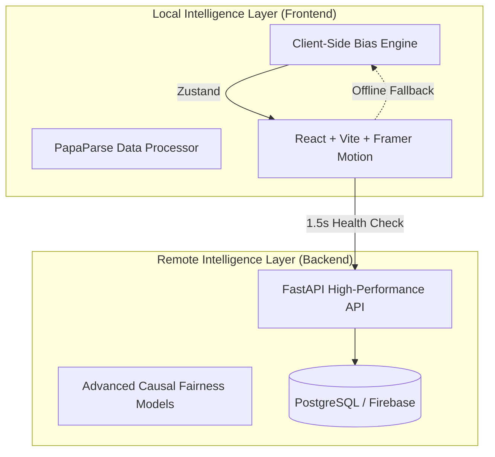

# 🛡️ EquityLens Intelligence

> **The next-generation healthcare fairness auditing platform. Detect bias, ensure regulatory compliance, and empower stakeholders with explainable AI.**

[](https://opensource.org/licenses/MIT)
[](https://reactjs.org/)
[](https://www.typescriptlang.org/)
[](https://tailwindcss.com/)
[](https://equitylens.ai)


---

## ⚡ The Intelligent Edge

EquityLens is engineered for **resilience, speed, and uncompromising integrity**. Unlike cloud-only tools, it features a sophisticated **Hybrid Intelligence Layer**:

- **Fast-Fail Backend Detection**: Automated latency monitoring and server health checks in <1.5 seconds.
- **Local Browser Auditing**: Seamless fallback to a high-performance in-browser bias engine (powered by PapaParse & custom WASM-ready logic).
- **Obsidian Void Design System**: A premium, high-fidelity aesthetic with deep-space dark mode, glassmorphism, and editorial typography tailored for medical/enterprise contexts.
- **Regulatory-Ready Mapping**: Built-in logic for **EU AI Act (Art. 10 & 13)** and **NIST AI RMF** compliance.

---

## 🛠️ Core Capabilities

### 1. Advanced Bias Diagnostics
*   **Demographic Parity**: Quantify outcome consistency across protected groups (Race, Gender, Age).
*   **Equal Opportunity**: Validate balance in True Positive Rates (e.g., ensuring cancer detection accuracy is consistent).
*   **Disparate Impact (80% Rule)**: Real-time screening for standard regulatory violations.
*   **Intersectional Matrix**: Uncover hidden biases at the crossing of multiple attributes.

### 2. High-Fidelity Reporting & Transparency
*   **Instant PDF Audits**: One-click generation of professional, audit-ready reports with deep subgroup analysis.
*   **Model Cards 2.0**: Standardized technical documentation for data scientists and regulators.
*   **Bias Nutrition Labels**: Simplified, plain-language summaries designed for patient understanding.

### 3. Patient Empowerment Portal
*   **Explainable Outcomes**: Visualizing the "Why" behind algorithmic decisions.
*   **Counterfactual Simulations**: Interactive "What-if" scenarios to help patients understand their results.
*   **Structured Appeals**: A formal, transparent workflow for contesting automated medical decisions.

---

## 🏗️ Technical Architecture

EquityLens utilizes a dual-engine architecture to ensure uptime and accuracy:



---

## 📂 Project Structure

```text
fairness-lens-studio/
├── backend/                # FastAPI Bias Detection Engine
│   └── demo-healthcare.csv # Specialized 5,000-row medical dataset
├── src/
│   ├── components/         # Reusable Shadcn/UI & custom components
│   ├── core/               # Shared logic, bias metrics, and hooks
│   ├── pages/              # Main view routes (Landing, Analysis, Dashboard)
│   ├── context/            # React Context providers (Auth, Theme)
│   └── styles/             # Global CSS & Obsidian Void theme tokens
├── tests/                  # Playwright E2E & Vitest unit tests
├── public/                 # Static assets & brand identity
└── docker-compose.yml      # Production orchestration
```

---

## 🚀 Getting Started

### Prerequisites
- Node.js (v18+)
- Python (v3.10+) for the backend engine

### Quick Start (Local Development)

1.  **Clone the Repository**
    ```bash
    git clone https://github.com/KunjShah95/fairness-lens-studio.git
    cd fairness-lens-studio
    ```

2.  **Install Dependencies**
    ```bash
    npm install
    ```

3.  **Environment Configuration**
    ```bash
    cp .env.example .env
    # Configure your VITE_API_URL and Firebase keys
    ```

4.  **Launch the Studio**
    ```bash
    npm run dev
    ```

---

## 📊 Evaluation Datasets

The platform includes a flagship medical dataset: **`backend/demo-healthcare-5000.csv`**.
- **Scope**: Medical Triage & Treatment Allocation.
- **Complexity**: 5,000 rows with 12+ clinical and demographic features.
- **Utility**: Pre-engineered with realistic bias vectors to stress-test auditing workflows and explainability tools.

---

## ⚖️ Compliance & Ethics

EquityLens is designed as a "compliance-first" tool, aligning with:
- **EU AI Act**: Direct support for Article 10 (Data Governance) and Article 13 (Transparency).
- **NIST AI RMF**: Implements the *Measure* and *Manage* pillars of the framework.
- **GDPR**: Facilitates Article 22 compliance through human-in-the-loop appeal workflows.

---

## 📄 License

This project is licensed under the MIT License - see the [LICENSE](LICENSE) file for details.

---

<p align="center">
  <b>© 2026 EquityLens Intelligence.</b><br/>
  Empowering the future of equitable healthcare through algorithmic accountability.
</p>